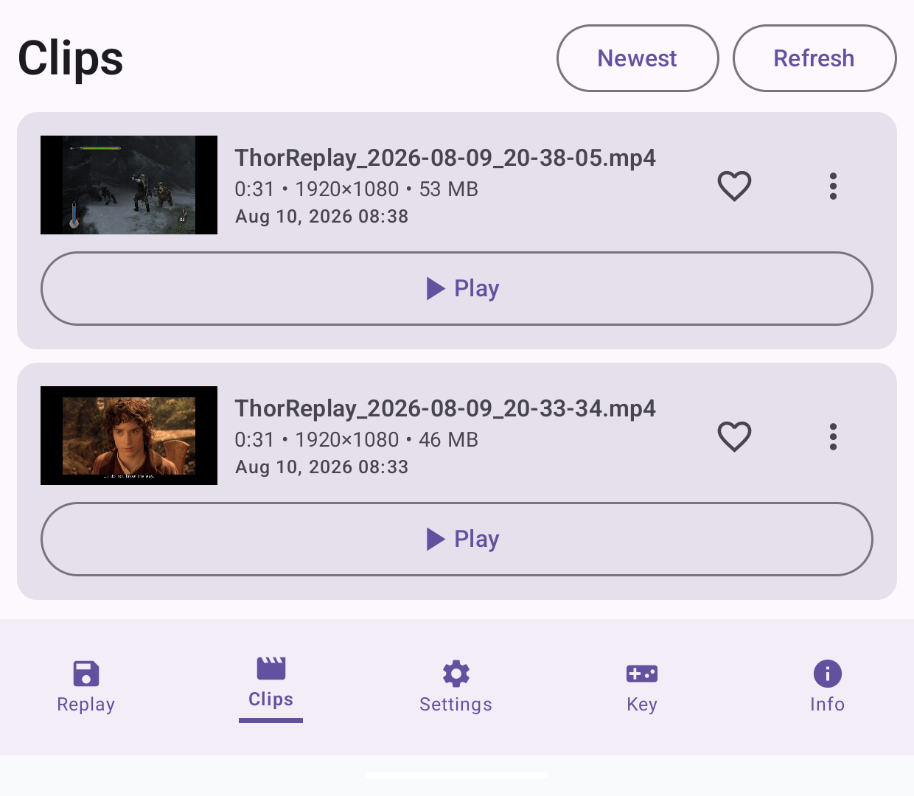
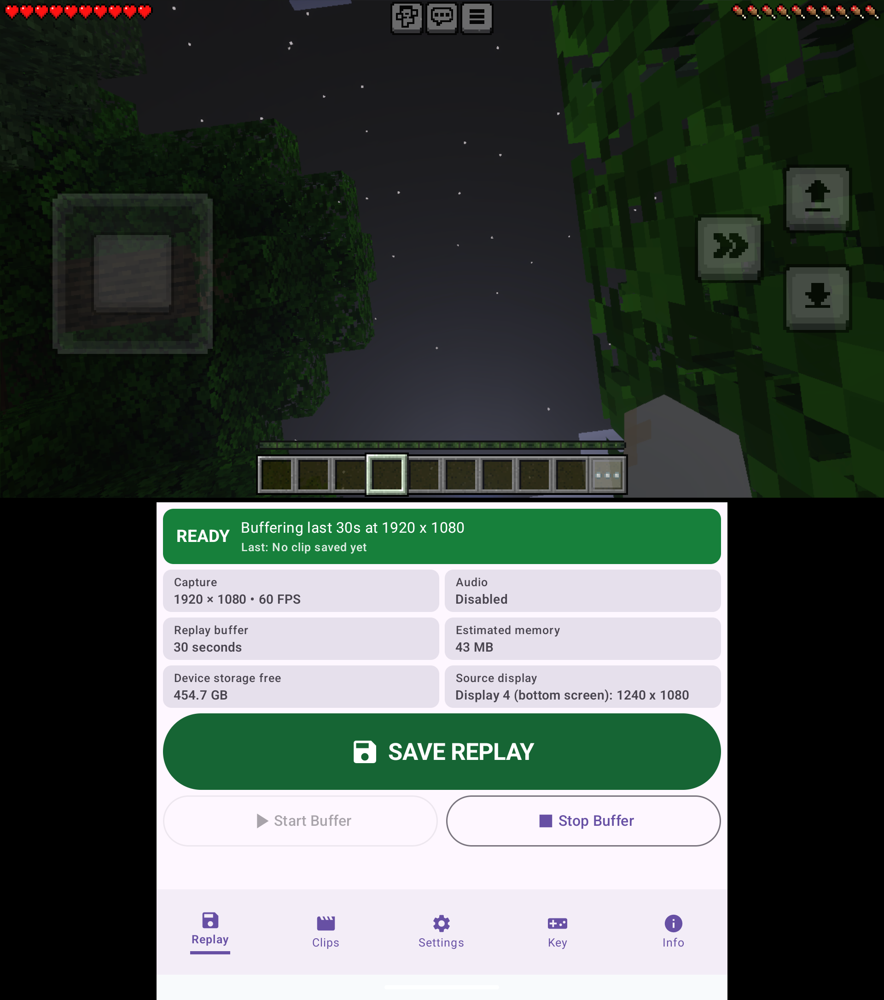
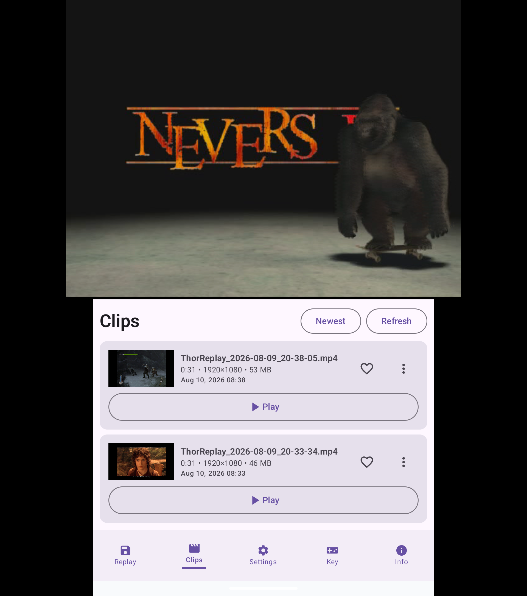

# 30 Seconds Ago

30 Seconds Ago is a lightweight Android replay-buffer app built for the AYN Thor dual-screen handheld. It keeps recent gameplay in memory and lets you save the last few seconds as an MP4 clip.

The app is designed around using the Thor bottom screen as a small replay dashboard while a game or emulator runs on the other screen.

> [!IMPORTANT]
> 30 Seconds Ago is made specifically for the **AYN Thor** and has not been tested on other devices. See [Help, Compatibility, and Known Issues](HELP.md) before installing or choosing capture settings.

## Screenshots

### Clip library

Saved replays include thumbnails, duration, resolution, file size, favorites, sorting, and quick playback controls.

<p align="center">
  
</p>

### Built for the AYN Thor dual-screen layout

Keep playing on the top screen while the replay dashboard or clip library remains available on the bottom screen.

| Replay buffer active | Browse clips while playing |
| --- | --- |
|  |  |

## Features

- First-time setup flow for quality, save folder, popup permission, alert screen, and controller hotkey guidance
- Color-coded replay dashboard with buffer state, capture details, storage information, and a large Save Replay button
- Configurable replay length
- Video quality presets, including 720p30, 720p60, 1080p30, and 1080p60
- Adjustable bitrate
- Optional internal audio capture when Android and the running app allow it
- Saved clips library with thumbnails, metadata, favorites, sorting, rename, and delete
- In-app MP4 playback
- Lossless beginning/end trimming with Save Copy and Replace Original options
- Open or share clips from inside the app
- Default `Movies/ThorReplay` save location or custom folder selection
- Custom filename templates
- Optional saved-clip popup on a selected Thor display
- Configurable controller hotkey through Android accessibility key events

## Recommended First Setup

For Dolphin, start with `720p60 Smooth`. Games with busy scenes or several active players may need `720p30 Standard` or a lower bitrate. Native Android games such as Fortnite and Minecraft have worked well at `1080p60 High` in testing so far.

See the [help and compatibility guide](HELP.md) for details about tested games, performance issues, and ways to avoid capture instability.

During setup, use `Allow Permission` and then `Test Alert` in the Saved Clip Alert section. Android may require popup permission before the saved-clip alert can appear on the selected screen.

The controller hotkey can be configured later. This is recommended because different emulators and games may already use different controller buttons. The bottom-screen dashboard always has a pressable `Capture Replay` button.

## How To Use

1. Open 30 Seconds Ago.
2. Complete the first-time setup.
3. Tap `Start` before playing.
4. Leave the app open on the Thor bottom screen.
5. Tap `Capture Replay` when something happens.
6. Open the `Clips` tab to play, open, or share saved clips.

## Saved Clips

By default, clips are saved to:

```text
Movies/ThorReplay
```

You can choose a different save folder from setup or Settings.

The Clips tab shows saved MP4 files with thumbnails and metadata. Tap `Play` to expand a clip and watch it inside the app. Use the three-dot menu to trim, rename, delete, open externally, or share a clip.

## Filename Templates

The app supports these filename tokens:

```text
{datetime}
{date}
{time}
{duration}
{resolution}
{fps}
```

Example:

```text
Thor_{date}_{time}_{resolution}_{fps}
```

## Tester Notes

This is an early test build.

Please test:

- Whether replay clips save correctly
- Whether clips are close to the selected replay length
- Whether the end of the replay is preserved when pressing Capture Replay
- Whether internal audio works in your games or emulators
- Whether clips play inside the app
- Whether sharing works with apps like Discord, Drive, Gmail, or YouTube
- Whether the saved-clip alert appears on the selected Thor screen
- Whether your chosen controller hotkey works reliably

## Known Limitations

- The app is built for the AYN Thor and has not been tested on other Android devices.
- Android screen capture permission is required when starting the replay buffer.
- Some games, emulators, or protected content may block internal audio capture.
- Some hardware or system buttons may not be visible to Android apps.
- The replay may be slightly over the selected length because the app saves from the nearest safe video keyframe.
- Dolphin and the screen recorder compete for GPU resources. Busy games can cause capture hiccups or crashes, even at the recommended `720p60` setting. If a game becomes unstable, use `720p30` or a lower bitrate.

For game-specific guidance and troubleshooting, read [Help, Compatibility, and Known Issues](HELP.md).

## Build A Debug APK

From the project root:

```bash
./gradlew assembleDebug
```

The debug APK is created at:

```text
app/build/outputs/apk/debug/app-debug.apk
```

## Build A Release APK

Create or configure a signing key in Android Studio, then build a release APK from Android Studio or Gradle.

The Android package name is:

```text
com.thirtysecondsago.thorreplay
```

## Credits

Made by Ryan Arthur Walker using AI. Ryan actually has no idea how to code.
